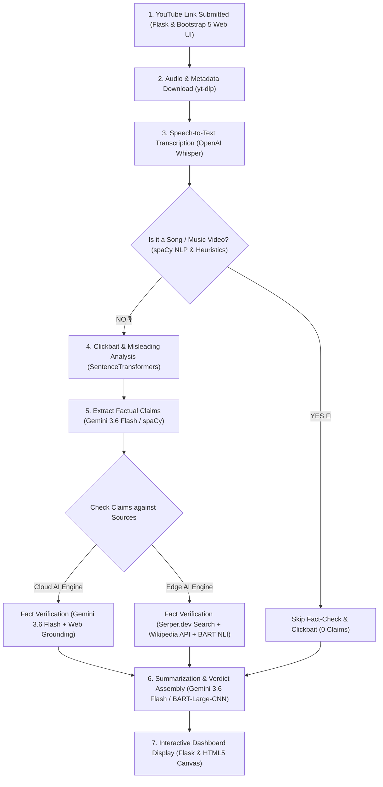

# 🎥 VeriTube - Automated YouTube Fact Checker & Clickbait Detector

**VeriTube** is an end-to-end multimodal AI application designed to verify YouTube video content in real-time. It automatically transcribes audio, evaluates title sensationalism (clickbait/misleading scoring), extracts testable factual claims, and cross-verifies claims using **Google Gemini 3.6 Flash** (with automatic model discovery & failover) or an **Edge AI Local Pipeline** (Spacy, SentenceTransformers, BART NLI, Wikipedia, and Google Serper Search).

---

## 🌟 Key Features

- **🎙️ Speech-to-Text Transcription**: Powered by OpenAI's **Whisper** model (with automatic PyTorch CUDA GPU acceleration).
- **🧠 Dual-Engine Fact Checking**:
  - **Cloud AI Engine**: Powered by **Google Gemini 3.6 Flash** (auto-healing model discovery & web-grounded verification).
  - **Edge AI Local Engine**: Uses `spaCy` NLP, `SentenceTransformers` (`all-MiniLM-L6-v2`), `Facebook BART MNLI` NLI models, Wikipedia API, and Google Serper Web Search.
- **🚨 Clickbait & Misleading Title Detection**: Algorithmic scoring that compares title hyperbolic triggers and transcript semantic alignment.
- **🎵 Smart Music Video Guardrail**: Detects song structures/lyrics to automatically skip false claim extractions (`0 CLMS`).
- **🎨 Interactive Neo-Brutalist Dashboard**: Dynamic bulging background grid, glowing cursor spotlight, light/dark theme persistence, and expandable claim verdict cards.

---

## 🏗️ System Architecture



---

## 🚀 Setup & How to Run

### 1. Prerequisites
- **Python 3.10+** installed on your system.
- An optional `.env` file in the project root containing your API key:
  ```env
  GEMINI_API_KEY=your_google_gemini_api_key_here
  ```

---

### 2. Create & Activate Virtual Environment

Open **PowerShell** in the root directory (`VeriTube - YouTube Fact Checker`) and execute:

```powershell
# Step 1: Create the virtual environment named .venv
python -m venv .venv

# Step 2: Activate the virtual environment
.\.venv\Scripts\activate

# Step 3: Install all required dependencies
pip install -r requirements.txt

# Step 4: Download the spaCy NLP model
python -m spacy download en_core_web_sm
```

---

### 3. Running the Web Application (Flask UI)

After activating the environment, run:

```powershell
# Navigate to the backend directory
cd backend

# Launch the Flask web server
python app.py
```

Once launched, open your browser and navigate to:
👉 **`http://127.0.0.1:5000`**

---

### 4. Running the Terminal CLI Version

If you prefer running VeriTube directly from the command line:

```powershell
# From the backend directory with virtual environment activated
python main.py
```

---

## 📂 Project Structure

```
VeriTube - YouTube Fact Checker/
├── .env                       # Local environment variables (API keys)
├── .gitignore                 # Excludes temp audio, .env, and cache files
├── README.md                  # Project documentation
└── backend/
    ├── app.py                 # Main Flask web application routes & API
    ├── main.py                # Command-line interface runner
    ├── fact_checker.py        # Core claim extraction & NLI verification logic
    ├── gemini_engine.py       # Google Gemini 3.6 Flash AI integration
    ├── clickbait_detector.py  # Sensationalism & misleading title scoring engine
    ├── summarizer.py          # Abstractive & extractive transcript summarizer
    ├── transcriber.py         # Whisper speech-to-text integration
    ├── youtube_audio.py       # yt-dlp audio stream downloader
    ├── utils.py               # Spacy & classifier utility functions
    ├── benchmark/             # Performance evaluation suite & dataset
    │   ├── dataset.json
    │   └── run_evaluation.py
    ├── static/                # CSS, JavaScript & styling assets
    │   └── css/style.css      # Neo-Brutalist design tokens & canvas grid styles
    └── templates/             # Jinja2 HTML templates
        ├── base.html          # Base layout & interactive background canvas
        ├── index.html         # Video URL input homepage
        └── result.html        # Comprehensive fact-check dashboard
```

---

## ⚙️ Technical Pipeline Breakdown

| Phase | Module | Description |
| :--- | :--- | :--- |
| **Audio Extraction** | `youtube_audio.py` | Downloads audio streams silently via `yt-dlp`. |
| **Speech-to-Text** | `transcriber.py` | Converts audio to transcript via OpenAI Whisper model. |
| **Clickbait Analysis** | `clickbait_detector.py` | Measures title sensationalism vs transcript context. |
| **Claim Verification** | `fact_checker.py` | Identifies claims and verifies entailement against sources. |
| **Cloud AI Engine** | `gemini_engine.py` | Real-time web-grounded verification via Gemini 3.6 Flash. |
| **Dashboard UI** | `templates/` | Renders interactive verdicts, claim cards, and transcripts. |

---

## 📄 License & Attribution

Developed with ❤️ using Python, Flask, OpenAI Whisper, Google Gemini API, HuggingFace Transformers, spaCy, and Bootstrap 5.
